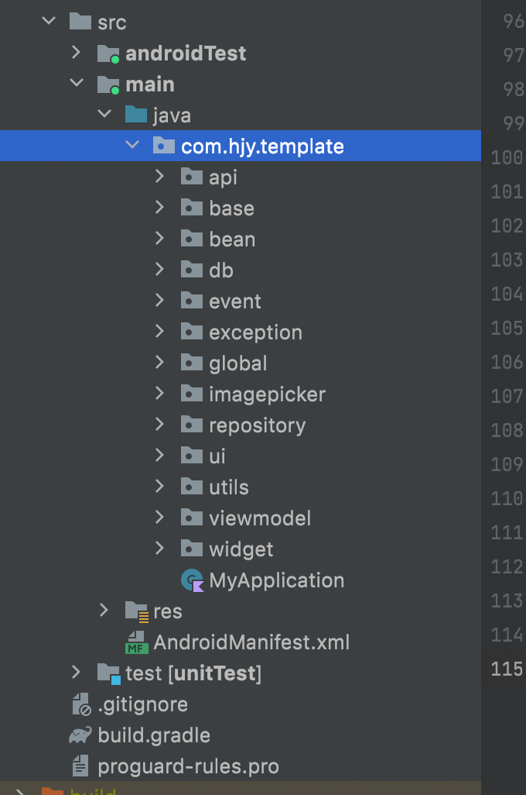

## 介绍

采用 Kotlin+Coroutine+Flow 实现的 MVVM 架构，基于"玩Android"提供的 API，实现的一个该架构的 Demo 工程。

## 项目总体结构

全部代码采用 kotlin 开发，基于 MVVM 架构来实现，在 ViewModel 层没有使用 LiveData 而是使用了 Google 最新推荐的 Flow，路由采用了阿里的 ARouter 框架，网络请求是 Retrofit+Okhttp+Flow 框架，数据缓存采用微信的 MMKV 框架来代替 SharedPreference，数据库操作方面则是采用了 Room 来实现，事件通知(EventBus)采用了基于 Kotlin Flow 实现的自定义 FlowEventBus，除此外就是一些常见的比较流行的开源库，可以说麻雀虽小去脏俱全，开发一个 APP 所需的基本都囊括了。此外，没有使用 DataBinding 技术，纯属个人喜好，开发复杂项目包括维护他人项目查找问题等，个人觉得会带来很多麻烦。

整体包结构图如下所示：





#### 1. api

Retrofit+Okhttp 的配置以及工具类，项目所用的接口 api 都定义在此。

#### 2. base

主要是 BaseActivity、BaseFragment、BaseViewModel 等的定义，所有的 Activity、Fragment、ViewModel 类都必须继承这些类，这里定义了一些 Activity/Fragment、ViewModel 的通用方法。

BaseViewModel 里：

```kotlin
//进行 Toast 提示
fun toastLong(msg: CharSequence)
fun toastShort(msg: CharSequence)

//在当前 Activity/Fragment 里显示或者隐藏 Loading 弹窗
fun showLoading(msg: CharSequence)
fun hideLoading()

//关闭当前 Activity
fun closeCurrPage()

/**
* 构造一个 API 请求的 flow
*
* @param showError 是否自动弹出错误信息，默认为 true，注意不管怎样错误都会继续传递下去，
*                  很多时候你还需要在发生错误时处理一些额外的业务逻辑
* @param apiRequest
*/
suspend fun <T> launchApiRequestFlow(
        showError: Boolean = true,
        apiRequest: suspend () -> Flow<T>
    ): Flow<T>

//向与该 ViewModel 绑定的 Activity/Fragment 发送一个事件通知
inline fun <reified T: BaseEvent> postInternalPageEvent(event: T)
```


BaseActivity/BaseFragment：

```kotlin
//改变状态栏字体颜色以适应浅色模式和深色模式
fun changeStatusBarFontColor(isLight: Boolean)

//基于 Lifecycle 的 repeatOnLifeCycle 来启动协程
fun launchAtLeast(state: Lifecycle.State = Lifecycle.State.CREATED, block: suspend CoroutineScope.() -> Unit)

//对应 ViewModel 隐藏/显示 Loading 弹窗的具体逻辑
fun showLoadingDialog(msg: CharSequence)
fun dismissLoadingDialog()

//对应 ViewModel 通过 postInternalPageEvent() 方法发送的事件，在这里进行初始化监听
inline fun <reified T : BaseEvent> subscribeInternalPageEvent(
        state: Lifecycle.State = Lifecycle.State.CREATED,
        dispatcher: CoroutineDispatcher? = null, noinline onEvent: (event: T) -> Unit)
```


#### 3. bean

主要是 api 接口请求的一些实体类的定义


#### 4. db

采用 Android Room 库实现的数据库操作，数据库 entitry、dao 等的定义都在这里。


#### 5. event

基于 Kotlin Flow 实现的 EventBus，主要分为事件定义、事件发送、事件接收：

* BaseEvent：应用进程内所有的事件必须继承该类，已定义几个基本的全局事件- LogoutEvent、LoginEvent、ToastEvent、ShowLoadingDialogEvent、ClosePageEvent、TokenInvalidEvent，基本上包括了应用类几个通用的事件。
* BusinessEvent：业务自定义事件。
* EventPost：全局事件发送的定义类，可发送粘性与非粘性事件。默认是发送全局非粘性事件，不管有没有事件订阅者，该事件都是一次性消费的。
* EventSubscribe：包含全局事件订阅方法，主要包括在 Activity/Fragment、ViewModel 中订阅全局事件的方法。可以订阅粘性和非粘性事件，目前发送粘性事件和订阅粘性事件必须是一一匹配对应的。
* FlowEventBus：EventBus 的实现类，默认通过 `companion object GLBOAL` 来实现全局事件通知，如果仅限于页面内等局部范围的通知，直接自定义一个对象即可。

```kotlin
//在 ViewModel 里发送事件 “Token过期失效”
postEvent(BaseEvent.TokenInvalidEvent(null))

//在 Activity/Fragment里可以这样订阅事件
subscribeEventAtLeast<BaseEvent.TokenInvalidEvent>(Lifecycle.State.RESUMED) {
	//这里处理收到通知事件的逻辑
}

```


#### 6. exception

系统内自定义异常。

#### 7. repository

应用内所有的数据操作都定义在此。

#### 8. viewmodel

所有 ViewModel 都定义在此，LiveData 全部使用 MutableStateFlow 代替。

```kotlin
private val _articleListFlow = MutableStateFlow<Resource<List<Article>>>(Resource(null))
val articleListFlow = _articleListFlow.asStateFlow()
```


#### 9. ui

Activity/Fragment 的定义。

#### 10. global

应用全局需要用到的一些类：

* Constants：一些全局常量的配置。
* Resource：配合 StateFlow 使用，StateFlow 只会在所关联的 value 引用发生变化时才会触发更新，如果一个 List 只是增删改 List 内部的元素，并不会触发更新，采用一个简单的包装可以避免该问题。
* UserInfoManager：单例类，全局用户信息管理，保存用户基本信息，用户登录的 token 信息等。通过 StateFlow 来获取，所有对用户信息的修改都会触发更新。多个不同页面对同一个 StateFlow 的收集，当数据发生变化时，页面都可自动做出响应。